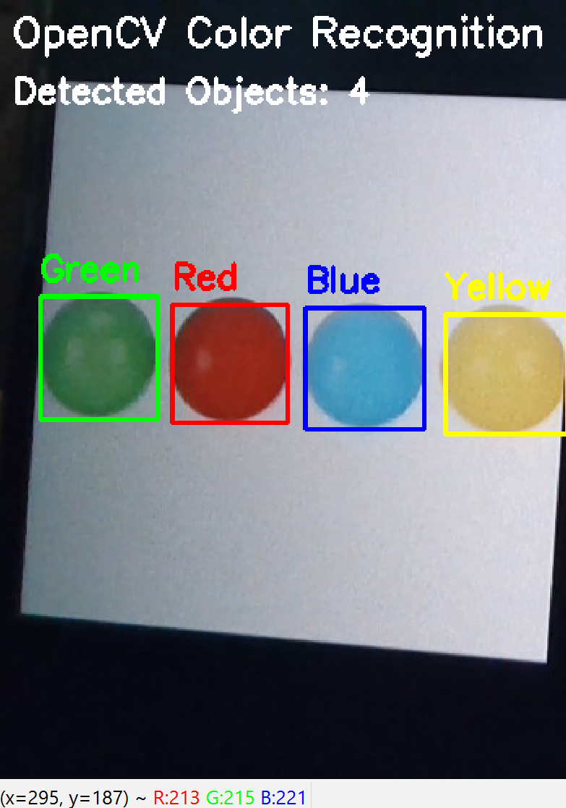

# OpenCV Color Recognition

## Overview

This project is a real-time color recognition system developed using Python and OpenCV. It uses a webcam to detect and recognize different colors, then draws a bounding box around each detected object and displays its color name.

## Features

- Real-time color detection using a webcam.
- Detects the following colors:
  - Red
  - Green
  - Blue
  - Yellow
  - Orange
  - Purple
- Draws a bounding box around detected objects.
- Displays the detected color name.
- Counts the detected objects.

## Technologies Used

- Python
- OpenCV
- NumPy

## Files

- `main.py` – Main source code.
- `output.png` – Screenshot of the project output.

## How to Run

1. Open the project in Python.
2. Run `main.py`.
3. Allow access to the webcam.
4. Show colored objects in front of the camera.
5. The program will detect the color, draw a bounding box, and display its name.

## Output

## How It Works

1. The webcam captures live video.
2. Each frame is converted from BGR to HSV color space.
3. The program detects six different colors using predefined HSV ranges.
4. A bounding box is drawn around each detected object.
5. The detected color name is displayed above the object.
6. The number of detected objects is shown on the screen.

## Author

Developed as part of an OpenCV Color Recognition project using Python.
